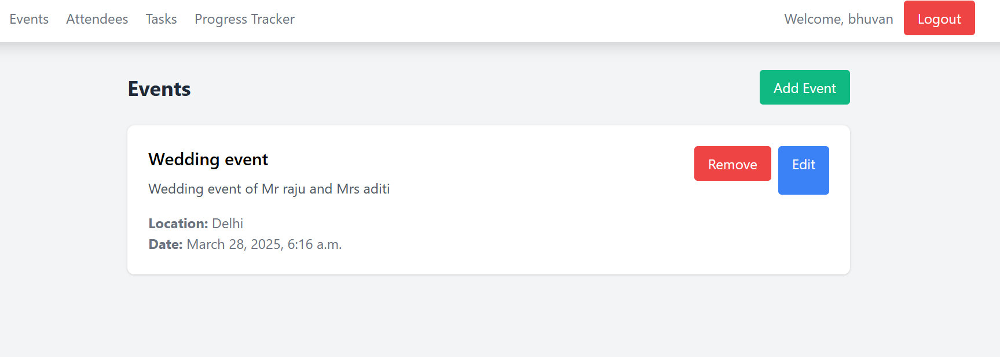

# Event Management Application



## Overview
This project is a Django-based event management system that provides the following features:
- Event creation and management.
- Attendee registration and management.
- Task assignment and tracking for events.
- RESTful API endpoints for integration.
- Responsive and dynamic UI templates.

---

## Models

### 1. Attendee Model
- Stores attendee details like:
  - Name
  - Email (unique to avoid duplication)
  - Phone number

### 2. Event Model
- Contains fields for:
  - Name
  - Description
  - Location
  - Date
- Includes:
  - Many-to-Many relationship with the `Attendee` model.
  - `ForeignKey` to the `User` model for event creator tracking.
  - Timestamps for creation and updates.

### 3. Task Model
- Includes fields for:
  - Name
  - Deadline
  - Status (choices: "Pending" or "Completed")
- Links to:
  - `Event` model (via `ForeignKey`)
  - `Attendee` model (via `ForeignKey`)
- Tracks creation and update timestamps.

### Implementation
1. Add `'dashboard'` to `INSTALLED_APPS` in `settings.py`.
2. Apply migrations:
   ```bash
   python manage.py makemigrations
   python manage.py migrate
   ```

---

## API Features

### Serializers
1. **AttendeeSerializer**: Handles serialization for attendee data.
2. **TaskSerializer**: Includes the assigned attendee's name.
3. **EventSerializer**: Serializes tasks and attendees with nested structures.

### ViewSets
1. **EventViewSet**:
   - CRUD operations for events.
   - Custom actions to add/remove attendees.
   - Filters events by the logged-in user.

2. **AttendeeViewSet**:
   - CRUD operations for attendees.

3. **TaskViewSet**:
   - CRUD operations for tasks.
   - Custom action to update task statuses.
   - Filters tasks based on the event creator.

### Setup Instructions
1. Install Django REST framework:
   ```bash
   pip install djangorestframework
   ```
2. Add `'rest_framework'` to `INSTALLED_APPS` in `settings.py`.

---

## URL Configuration

### API Endpoints
1. **Event API**:
   - List all events: `GET /api/events/`
   - Create an event: `POST /api/events/`
   - Retrieve event: `GET /api/events/{id}/`
   - Update event: `PUT /api/events/{id}/`
   - Delete event: `DELETE /api/events/{id}/`
   - Add attendee: `POST /api/events/{id}/add_attendee/`
   - Remove attendee: `POST /api/events/{id}/remove_attendee/`

2. **Attendee API**:
   - List all attendees: `GET /api/attendees/`
   - Create attendee: `POST /api/attendees/`
   - Retrieve attendee: `GET /api/attendees/{id}/`
   - Update attendee: `PUT /api/attendees/{id}/`
   - Delete attendee: `DELETE /api/attendees/{id}/`

3. **Task API**:
   - List all tasks: `GET /api/tasks/`
   - Create task: `POST /api/tasks/`
   - Retrieve task: `GET /api/tasks/{id}/`
   - Update task: `PUT /api/tasks/{id}/`
   - Delete task: `DELETE /api/tasks/{id}/`
   - Update status: `PATCH /api/tasks/{id}/update_status/`

### Testing Endpoints
You can test the endpoints using:
- Django's browsable API interface.
- Postman.
- curl commands, e.g.:
   ```bash
   # List all events
   curl -H "Authorization: Bearer your_token" http://localhost:8000/api/events/

   # Create a new event
   curl -X POST \
     -H "Authorization: Bearer your_token" \
     -H "Content-Type: application/json" \
     -d '{"name":"Team Meeting","description":"Monthly team meeting","location":"Conference Room","date":"2024-12-25T10:00:00Z"}' \
     http://localhost:8000/api/events/
   ```

---

## Templates

### 1. Base Template (`base.html`)
- Features:
  - Responsive navigation bar with authentication indicators.
  - Styling using Tailwind CSS.
  - Dynamic AJAX requests using Axios.

### 2. Event List Template (`event_list.html`)
- Features:
  - Displays a list of all events.
  - Add, edit, and delete functionality.
  - Modal form for creating/editing events.
  - Dynamic rendering with JavaScript.

### 3. Attendee Template (`attendee_list.html`)
- Features:
  - List all attendees.
  - Add, edit, and delete attendees.
  - Modal form for attendee management.

### 4. Task Template (`task_list.html`)
- Features:
  - List all tasks.
  - Add, update status, and delete tasks.
  - Modal form for task creation with event and attendee selection.
  - Status toggle functionality.

### Implementation Steps
1. Create a `templates` directory within the `dashboard` app:
   ```bash
   mkdir -p dashboard/templates/dashboard
   ```
2. Place templates in their respective locations:
   - `base.html` → `templates/base.html`
   - `event_list.html` → `templates/dashboard/event_list.html`
   - `attendee_list.html` → `templates/dashboard/attendee_list.html`
   - `task_list.html` → `templates/dashboard/task_list.html`

3. Update `settings.py` to configure the template directory:
   ```python
   TEMPLATES = [
       {
           'BACKEND': 'django.template.backends.django.DjangoTemplates',
           'DIRS': [BASE_DIR / 'templates'],
           'APP_DIRS': True,
           ...
       },
   ]
   ```

4. Add views in `views.py`:
   ```python
   from django.shortcuts import render
   from django.contrib.auth.decorators import login_required

   @login_required
   def attendee_list(request):
       return render(request, 'dashboard/attendee_list.html')

   @login_required
   def task_list(request):
       return render(request, 'dashboard/task_list.html')
   ```

---

## Authentication & User Management

### Authentication Views
- Includes login and logout functionality.

### Configuration
1. Update `settings.py`:
   ```python
   LOGIN_URL = 'login'
   LOGIN_REDIRECT_URL = 'event_list'
   LOGOUT_REDIRECT_URL = 'login'
   ```

2. Create a superuser for testing:
   ```bash
   python manage.py createsuperuser
   ```

3. Apply migrations and start the server:
   ```bash
   python manage.py makemigrations
   python manage.py migrate
   python manage.py runserver
   ```

---


## API Details

### Authentication

- **Login**
    - URL: `/api/auth/login/`
    - Method: [POST](http://_vscodecontentref_/2)
    - Description: Authenticates a user and returns a token.
    - Request Body:
        ```json
        {
            "username": "user",
            "password": "pass"
        }
        ```
    - Response:
        ```json
        {
            "token": "your_token"
        }
        ```

- **Logout**
    - URL: `/api/auth/logout/`
    - Method: [POST](http://_vscodecontentref_/3)
    - Description: Logs out the authenticated user.
    - Headers:
        ```json
        {
            "Authorization": "Token your_token"
        }
        ```

### Event Management

- **List Events**
    - URL: `/api/events/`
    - Method: `GET`
    - Description: Retrieves a list of all events.
    - Response:
        ```json
        [
            {
                "id": 1,
                "name": "Event 1",
                "description": "Description of Event 1",
                "location": "Location 1",
                "date": "2023-10-01",
                "attendees": [],
                "tasks": [],
                "created_by": 1,
                "created_at": "2023-09-01T12:00:00Z",
                "updated_at": "2023-09-01T12:00:00Z"
            },
            ...
        ]
        ```

- **Create Event**
    - URL: `/api/events/`
    - Method: [POST](http://_vscodecontentref_/4)
    - Description: Creates a new event.
    - Request Body:
        ```json
        {
            "name": "Event 1",
            "description": "Description of Event 1",
            "location": "Location 1",
            "date": "2023-10-01"
        }
        ```
    - Response:
        ```json
        {
            "id": 1,
            "name": "Event 1",
            "description": "Description of Event 1",
            "location": "Location 1",
            "date": "2023-10-01",
            "attendees": [],
            "tasks": [],
            "created_by": 1,
            "created_at": "2023-09-01T12:00:00Z",
            "updated_at": "2023-09-01T12:00:00Z"
        }
        ```

- **Retrieve Event**
    - URL: `/api/events/{id}/`
    - Method: `GET`
    - Description: Retrieves details of a specific event.
    - Response:
        ```json
        {
            "id": 1,
            "name": "Event 1",
            "description": "Description of Event 1",
            "location": "Location 1",
            "date": "2023-10-01",
            "attendees": [],
            "tasks": [],
            "created_by": 1,
            "created_at": "2023-09-01T12:00:00Z",
            "updated_at": "2023-09-01T12:00:00Z"
        }
        ```
- **Delete Event**
    - URL: `/api/events/{id}/`
    - Method: `DELETE`
    - Description: Deletes a specific event.
    - Response: `204 No Content`


- **Update Event**
    - URL: `/api/events/{id}/`
    - Method: `PUT`
    - Description: Updates details of a specific event.
    - Request Body:
        ```json
        {
            "name": "Updated Event",
            "description": "Updated Description",
            "location": "Updated Location",
            "date": "2023-10-02"
        }
        ```
    - Response:
        ```json
        {
            "id": 1,
            "name": "Updated Event",
            "description": "Updated Description",
            "location": "Updated Location",
            "date": "2023-10-02",
            "attendees": [],
            "tasks": [],
            "created_by": 1,
            "created_at": "2023-09-01T12:00:00Z",
            "updated_at": "2023-09-01T12:00:00Z"
        }
        ```


### Task Management

- **List Tasks**
    - URL: `/api/tasks/`
    - Method: `GET`
    - Description: Retrieves a list of all tasks.
    - Response:
        ```json
        [
            {
                "id": 1,
                "name": "Task 1",
                "description": "Description of Task 1",
                "deadline": "2023-10-01T12:00:00Z",
                "status": "pending",
                "event": 1,
                "assigned_to": 1,
                "assigned_to_name": "Attendee 1",
                "created_at": "2023-09-01T12:00:00Z",
                "updated_at": "2023-09-01T12:00:00Z"
            },
            ...
        ]
        ```

- **Create Task**
    - URL: `/api/tasks/`
    - Method: [POST](http://_vscodecontentref_/6)
    - Description: Creates a new task.
    - Request Body:
        ```json
        {
            "name": "Task 1",
            "description": "Description of Task 1",
            "deadline": "2023-10-01T12:00:00Z",
            "status": "pending",
            "event": 1,
            "assigned_to": 1
        }
        ```
    - Response:
        ```json
        {
            "id": 1,
            "name": "Task 1",
            "description": "Description of Task 1",
            "deadline": "2023-10-01T12:00:00Z",
            "status": "pending",
            "event": 1,
            "assigned_to": 1,
            "assigned_to_name": "Attendee 1",
            "created_at": "2023-09-01T12:00:00Z",
            "updated_at": "2023-09-01T12:00:00Z"
        }
        ```

- **Update Task**
    - URL: `/api/tasks/{id}/`
    - Method: `PUT`
    - Description: Updates details of a specific task.
    - Request Body:
        ```json
        {
            "name": "Updated Task",
            "description": "Updated Description",
            "deadline": "2023-10-02T12:00:00Z",
            "status": "completed",
            "event": 1,
            "assigned_to": 1
        }
        ```
    - Response:
        ```json
        {
            "id": 1,
            "name": "Updated Task",
            "description": "Updated Description",
            "deadline": "2023-10-02T12:00:00Z",
            "status": "completed",
            "event": 1,
            "assigned_to": 1,
            "assigned_to_name": "Attendee 1",
            "created_at": "2023-09-01T12:00:00Z",
            "updated_at": "2023-09-01T12:00:00Z"
        }
        ```


- **Retrieve Task**
    - URL: `/api/tasks/{id}/`
    - Method: `GET`
    - Description: Retrieves details of a specific task.
    - Response:
        ```json
        {
            "id": 1,
            "name": "Task 1",
            "description": "Description of Task 1",
            "deadline": "2023-10-01T12:00:00Z",
            "status": "pending",
            "event": 1,
            "assigned_to": 1,
            "assigned_to_name": "Attendee 1",
            "created_at": "2023-09-01T12:00:00Z",
            "updated_at": "2023-09-01T12:00:00Z"
        }
        ```


- **Delete Task**
    - URL: `/api/tasks/{id}/`
    - Method: `DELETE`
    - Description: Deletes a specific task.
    - Response: `204 No Content`

- **Update Task Status**
    - URL: `/api/tasks/{id}/update_status/`
    - Method: `PATCH`
    - Description: Updates the status of a specific task.
    - Request Body:
        ```json
        {
            "status": "completed"
        }
        ```
    - Response:
        ```json
        {
            "status": "task status updated",
            "event_progress": [
                {
                    "event": "Event 1",
                    "total_tasks": 10,
                    "completed_tasks": 5,
                    "progress_percentage": 50.0
                },
                ...
            ]
        }
        ```


### Attendee Management

- **List Attendees**
    - URL: `/api/attendees/`
    - Method: `GET`
    - Description: Retrieves a list of all attendees.
    - Response:
        ```json
        [
            {
                "id": 1,
                "name": "Attendee 1",
                "email": "attendee1@example.com",
                "phone": "1234567890",
                "created_at": "2023-09-01T12:00:00Z"
            },
            ...
        ]
        ```

- **Create Attendee**
    - URL: `/api/attendees/`
    - Method: [POST](http://_vscodecontentref_/5)
    - Description: Creates a new attendee.
    - Request Body:
        ```json
        {
            "name": "Attendee 1",
            "email": "attendee1@example.com",
            "phone": "1234567890"
        }
        ```
    - Response:
        ```json
        {
            "id": 1,
            "name": "Attendee 1",
            "email": "attendee1@example.com",
            "phone": "1234567890",
            "created_at": "2023-09-01T12:00:00Z"
        }
        ```

- **Update Attendee**
    - URL: `/api/attendees/{id}/`
    - Method: `PUT`
    - Description: Updates details of a specific attendee.
    - Request Body:
        ```json
        {
            "name": "Updated Attendee",
            "email": "updated@example.com",
            "phone": "0987654321"
        }
        ```
    - Response:
        ```json
        {
            "id": 1,
            "name": "Updated Attendee",
            "email": "updated@example.com",
            "phone": "0987654321",
            "created_at": "2023-09-01T12:00:00Z"
        }
        ```


- **Retrieve Attendee**
    - URL: `/api/attendees/{id}/`
    - Method: `GET`
    - Description: Retrieves details of a specific attendee.
    - Response:
        ```json
        {
            "id": 1,
            "name": "Attendee 1",
            "email": "attendee1@example.com",
            "phone": "1234567890",
            "created_at": "2023-09-01T12:00:00Z"
        }
        ```


- **Delete Attendee**
    - URL: `/api/attendees/{id}/`
    - Method: `DELETE`
    - Description: Deletes a specific attendee.
    - Response: `204 No Content`


## Summary
This event management application provides:
- Comprehensive user authentication and authorization.
- Full-featured management of events, attendees, and tasks.
- A RESTful API for external integration.
- A responsive, dynamic UI for easy navigation and interaction.

Feel free to reach out for additional support or to suggest improvements!
